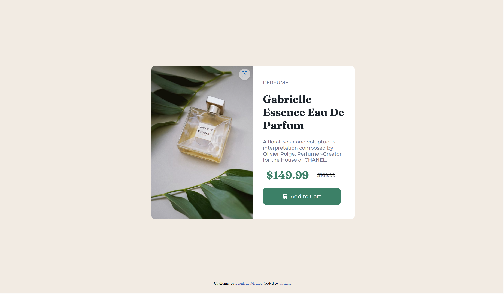

This is my solution to the challenge from front-emd mentor.
[Product preview card component challenge on Frontend Mentor](https://www.frontendmentor.io/challenges/product-preview-card-component-GO7UmttRfa)

[Frontend Mentor](https://www.frontendmentor.io) challenges help you improve your coding skills by building realistic projects.

This was done with basic knowledge of HTML and CSS.

## The challenge

THe challenge was to build out this product preview card component and get it looking as close to the design as possible.
## Table of contents

- [Overview](#overview)
  - [Screenshot](#screenshot)
  - [Links](#links)
- [My process](#my-process)
  - [Built with](#built-with)
  - [What I learned](#what-i-learn)
- [Author](#author)

## Overview

### Screenshot

### Links

solution-URL: []
live Site URL: []

## My process
I used HTML5 markup with some basic knowledge of css.

### Built with

- Semantic HTML5 markup
- CSS custom properties
- Flexbox
- Google fonts (Montserrat, Fraunces)

### What I learned

I learned the steps involved in using google fonts.

## Author

- Frontend Mentor - [@Blackysynch](https://www.frontendmentor.io/profile/Blackysynch)
- Twitter - [@ornelle_o](https://twitter.com/ornelle_o)